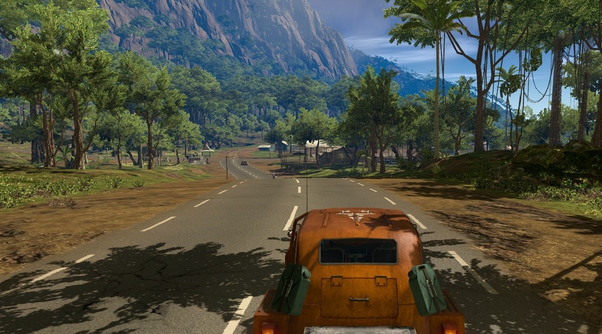

# Self-Driving-Car
A self driving car trained by supervised learning.

- The model is trained with the help of data collected while a human player is playing the game. 
- Then the model is trained on classifying the actions based on the input image from the screen. 
- The model can achieve near human player accuracy. 
- This model is really good for lane keeping. 

## Training process
### 1. Get images
- Grab the whole screen while player presses any of the control keys.
- Convert it into a gray scale image. (As we do not need any color data for this task.)
- Scale the image so that it can be fed into the CNN.
- Save the processed image to the disk along with the label(a one-hot vector).

### 2. Balance the dataset
As with any open world games the player moves forward a lot, not left not right. 
- To avoid bias towards the forward action. Balance the dataset. 
- Make sure all the actions' data points are equal in number.
- Convert the images to tensor and pickle the data for faster looping and shareability.

### 3. Train the model
- Train the classification model with CrossEntropyLoss.
- You can get a good accuracy if you use a large model.
- Train and test with different model architectures and have fun.
